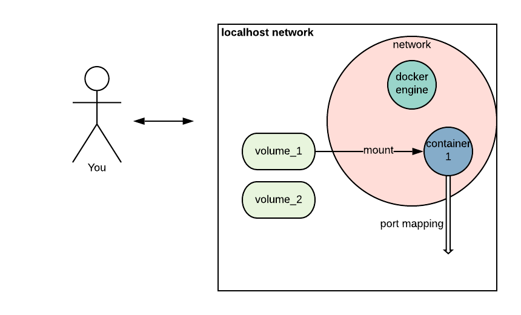

# 1-docker-engine

> Docker Engine is a client-server application with these major components

[Official documentation](https://docs.docker.com/engine/docker-overview/)
## Components
## 1-Docker daemon 
Core component.
> A server which is a type of long-running program called a daemon process.   

Verify that docker daemon is running
```bash
service docker status
```

## 2-Rest service
> A REST API which specifies interfaces that programs can use to talk to the daemon and instruct it what to do.

## 3-Client-cli(s)
> A command line interface (CLI) client (the docker command).

```bash
docker
docker-compose
docker-machine
```

`docker` and `docker-compose` are mostly in use. 

## Docker engine on local machine
Simplified representation


## Notes
Docker has directory for client-config. Usual location is `~/.docker`.

```bash
niks-MBP:.docker nik$ pwd
/Users/nik/.docker
niks-MBP:.docker nik$ ls
config.json     daemon.json     machine
```

## Problems
### 1 Docker daemon is not running.  
Log:
```bash
Cannot connect to the Docker daemon at unix:///var/run/docker.sock. Is the docker daemon running?
```
Solution:
Check docker daemon status.
```bash
# status
service docker status

# run (require sudo)
service docker start
```
Or you can use `systemctl` instead of `service`

[Reference to read more](https://www.2daygeek.com/how-to-check-all-running-services-in-linux/)
### 2 Docker sudo
It is not an issue, it is just annoying.  

Log:
```
denied: access forbidden
```
Solution: Add your user to the docker group.
```bash
sudo usermod -aG docker $USER
``` 
