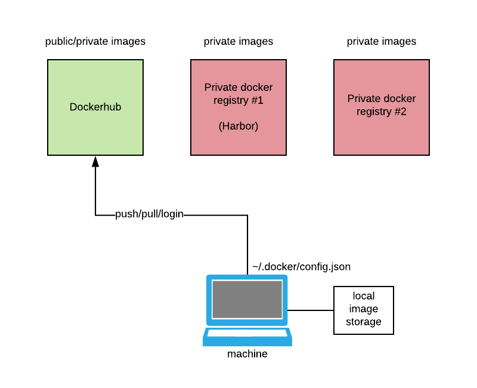

# 2.1 - docker registries
## Registries (DockerHub, Harbor, etc...) TL;DR 
Docker registries are repositories for images. Could be public or private.
* [https://hub.docker.com/](https://hub.docker.com/)
* Harbor -> private docker registry

**Simplified explanation** -> github for code, dockerhub for images.


Some of the public images are required signed agreement for development purposes.  
Example is [Oracle database images](https://hub.docker.com/_/oracle-database-enterprise-edition).

You can check docker-client setup in `~/.docker` directory
```bash
niks-MBP:docker-start nik$ cat ~/.docker/config.json 
{
        "auths": {
                "https://index.docker.io/v1/": {}
        },
        "HttpHeaders": {
                "User-Agent": "Docker-Client/19.03.5 (darwin)"
        },
        "credsStore": "osxkeychain",
        "stackOrchestrator": "swarm"
}
```
`!WARNING` : be careful with security for storing credentials. 

### Image naming convention
Convention:
```bash
<user>/<image_name>:<tag>
```
Convention is not restricted. 
You can name you image(s) whatever you like, but once you decide publish them (public, private), you have to follow this convention.