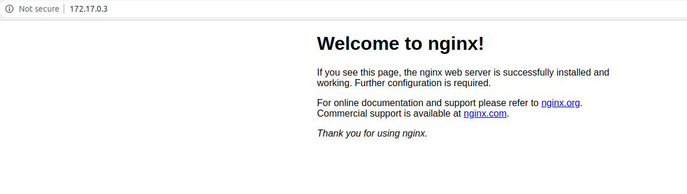

# 4.1-port-mapping
For exercise we will use [nginx](https://www.nginx.com/resources/wiki/) : web-server, load balancer, proxy, ...

Pull image:
```bash
docker pull nginx
```
[Nginx docker documentation](https://hub.docker.com/_/nginx)  

Run nginx container, check status and inspect:
```bash
docker run -d nginx
docker ps
docker inspect <container_id>
```
Output example:
```bash
# docker ps
CONTAINER ID        IMAGE               COMMAND                  CREATED             STATUS              PORTS               NAMES
29720bc57aa6        nginx               "nginx -g 'daemon of…"   About an hour ago   Up About an hour    80/tcp              objective_payne

# docker inspect <container_id>
...
"Ports": {
                "80/tcp": null
            },
...
"IPAddress": "172.17.0.3",
...
```
Pay attention to ports. 
If you inspect container for IPAddress and Port, you can access it from local machine, because container network is `bridge`.  

Check in browser `172.17.0.3:80`  



### Port mapping container
Mapping port to localhost.  
Start two new containers and check status:
```bash
docker run -d -p 8081:80 nginx
docker run -d -p 8082:80 nginx

docker ps
```
Output example:
```bash
docker ps
CONTAINER ID        IMAGE               COMMAND                  CREATED             STATUS              PORTS                  NAMES
67d78d4a8c14        nginx               "nginx -g 'daemon of…"   2 seconds ago       Up 1 second         0.0.0.0:8082->80/tcp   pedantic_panini
03318f5c2771        nginx               "nginx -g 'daemon of…"   7 seconds ago       Up 6 seconds        0.0.0.0:8081->80/tcp   distracted_lamport
29720bc57aa6        nginx               "nginx -g 'daemon of…"   About an hour ago   Up About an hour    80/tcp                 objective_payne
```
Now you have three nginx containers. 
One container does not have mapping port, others mapped to different port on localhost.  
Go to browser and check:
```bash
# URL
http://localhost:8081
http://localhost:8082
```

### Port mapping in docker-compose.yml
Example of docker-compose.yml file:
```yaml
version: '3'
services: # port mapping examples
  nginx1:
    image: nginx
    ports:
    - 8084:80         # <localhost_port>:<container_port>

  nginx2:
    image: nginx
    ports:
      - 18084:80
  
  nginx3:
    image: nginx
    ports:
      - 6666:80
```
Start docker container composition and check status:
```bash
docker-compose up -d

docker-compose ps
```

Output example:
```bash
docker-compose ps
       Name                Command          State           Ports        
-------------------------------------------------------------------------
4-network_nginx1_1   nginx -g daemon off;   Up      0.0.0.0:8084->80/tcp 
4-network_nginx2_1   nginx -g daemon off;   Up      0.0.0.0:18084->80/tcp
4-network_nginx3_1   nginx -g daemon off;   Up      0.0.0.0:6666->80/tcp
```

### Port mapping vs host networking
> Note: Given that the container does not have its own IP-address when using host mode networking, port-mapping does not take effect...

[Official docker documentation](https://docs.docker.com/network/host/)
[Nomad docker driver #network_mode](https://www.nomadproject.io/docs/drivers/docker.html#network_mode)

Nomad task example:
```hcl
task "kafka-broker" {
      driver = "docker"
      config {
        image = "confluentinc/cp-kafka:5.3.1"
        network_mode = "host"
      }
}
```